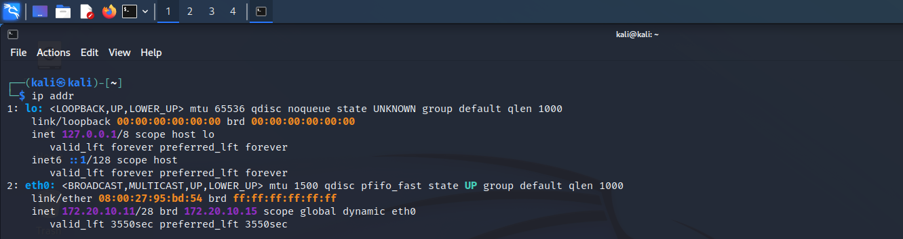

# Linux-Network-Troubleshooting-Lab

## Overview:

This lab demonstrates practical skills in Linux network inspection, troubleshooting, port analysis, and service management using Kali Linux.  
It focuses on the following tools and commands:

- `ip addr` – Inspect and configure network interfaces  
- `ss` / `netstat` – Inspect open ports and active connections  
- `systemctl` – Manage system services  
- `ping` – Test network connectivity  

The purpose is to gain hands-on experience in **systems administration** and **network troubleshooting**, which are critical skills for cybersecurity and IT operations.

---

## Lab Environment:
- Kali Linux 
- Oracle VM VirtualBox
- Bridged Adaptor mode

---

## Step 1 - Network Interfaces Inspection

### Objective:
- Identify active network interfaces
- Check IP addresses, subnet masks, and interface status

### Commands:
```bash
# List all interfaces and IP addresses
ip addr

# Alternative (deprecated)
ifconfig
```


### Notes:
- The UP state indicates the interface is active
- /28 indicates the subnet mask 255.255.255.240
- 172.20.10.11 is the assigned private IP
- 172.20.10.15 is the broadcast IP

---

## Step 2 - Network Failure and Troubleshooting Simulation

### Objective:
- Understand what happens when IP or gateway is misconfigured
- Learn how to restore network connectivity

### Commands:
```bash
# Temporarily remove IP address
sudo ip addr flush dev eth0

# Test connectivity
ping 8.8.8.8  # Should fail

# Renew IP via DHCP
sudo dhclient eth0

# Test connectivity again
ping 8.8.8.8  # Should succeed
```


### Notes:
- Flushing IP removes your interface configuration → network down
- `dhclient` requests a new IP from the DHCP server
- This is a realistic troubleshooting scenario for broken networks

---

## Step 3 - Open Ports Inspection

### Objective:
- Identify services running on the server
- Understand what ports are listening for incoming connections

### Commands:
```bash
# List all listening TCP and UDP ports
ss -tulnp

# Alternative (older)
netstat -tulnp

# Check specific port (e.g., SSH port 22) eventhough it wasn't active
ss -tulnp | grep :22
```


### Notes:
- `0.0.0.0` → listening on all UDP port 68
- Monitoring ports is critical for security

---

## Step 4 - Service Management

### Objective:
- Start, stop, restart, and check status of system services
- Understand how services relate to open ports

### Commands:
```bash
# Check service status (SSH)
systemctl status ssh

# Stop a service
sudo systemctl stop ssh

# Verify ports again
ss -tulnp | grep :22  # Port 22 should be gone

# Start service
sudo systemctl start ssh
```


### Notes:
- Stopping services removes their listening ports
- `sudo systemctl restart <service>` will restart a service, making it useful after configuration changes
- `sudo systemctl enable <service>` will enable service, ensuring persistence after reboot

---

## Conclusion:

- Learned to inspect and configure network interfaces `ip addr`
- Simulated and fixed network connectivity issues
- Identified listening services and ports `ss`
- Controlled services `systemctl` and observed port behavior
- Understood practical connections between network configuration and system security
